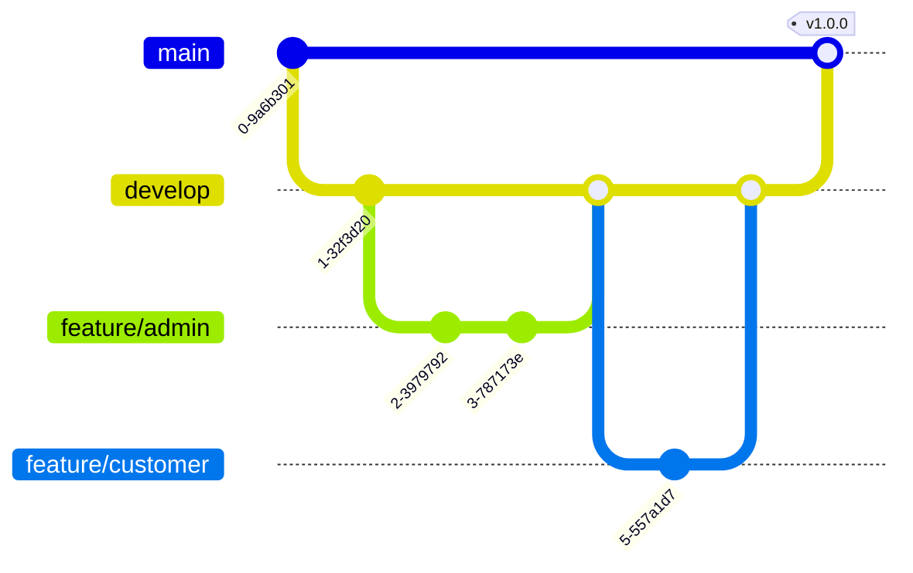

# Zephyra - Git Branching and Integration Strategy

Since multiple developers are developing the **Zephyra** codebase simultaneously, we adhere to a structured Git branching strategy modeled on GitFlow to minimize merge conflicts and maintain code quality.

---

## 1. Branch Hierarchy



### Main Branches
- **`main`**: Reflects the production-ready state. No direct commits allowed. Only accepts pull requests (PRs) from `develop`.
- **`develop`**: The main integration branch for active development. Features are branched out of and merged back into this branch.

### Feature Branches
Developers work on dedicated feature branches categorized by domain boundaries:
- `feature/customer/*` - Frontend/backend features scoped for customer pages or cart/ordering logic.
- `feature/admin/*` - Admin analytics, product registry panel, or override tools.
- `feature/delivery/*` - Delivery agent available jobs lists, GPS coordinates, location sockets.
- `feature/infrastructure/*` - Tooling setup, lint rules, global DB configs.

---

## 2. Commit Message Standards

We use structured semantic commits: `<type>(<scope>): <description>`

### Allowed Types:
- `feat`: A new feature or endpoint.
- `fix`: A bug fix.
- `docs`: Documentation changes only.
- `style`: Formatting, spacing, lint fixes (no production logic change).
- `refactor`: Code changes that neither fix a bug nor add a feature.
- `chore`: Updating build tasks, packages, or config dependencies.

### Examples:
- `feat(client-cart): bind zustand cartStore quantity controls to Button component`
- `fix(server-sockets): catch null coordinate reference on agent location-update`
- `docs(root): update installation guidelines for Node.js subpath imports`

---

## 3. Minimizing Merge Conflicts

To prevent simultaneous edits on shared files, developers must follow these modular conventions:
1. **Scope dependencies in features**: Implement business logic inside separate files under `client/src/features/` or `server/src/tracking/` rather than adding logic directly to layouts or global routers.
2. **Rebase regularly**: Before opening a Pull Request, rebase your feature branch onto `develop` to resolve conflicts locally:
   ```bash
   git fetch origin
   git checkout feature/your-feature
   git rebase origin/develop
   ```
3. **Keep PRs small**: Merge small, isolated features frequently instead of large monolithic blocks.
4. **Use unique IDs**: Ensure all new interactive elements in the UI have unique IDs to avoid conflicting test identifiers.
